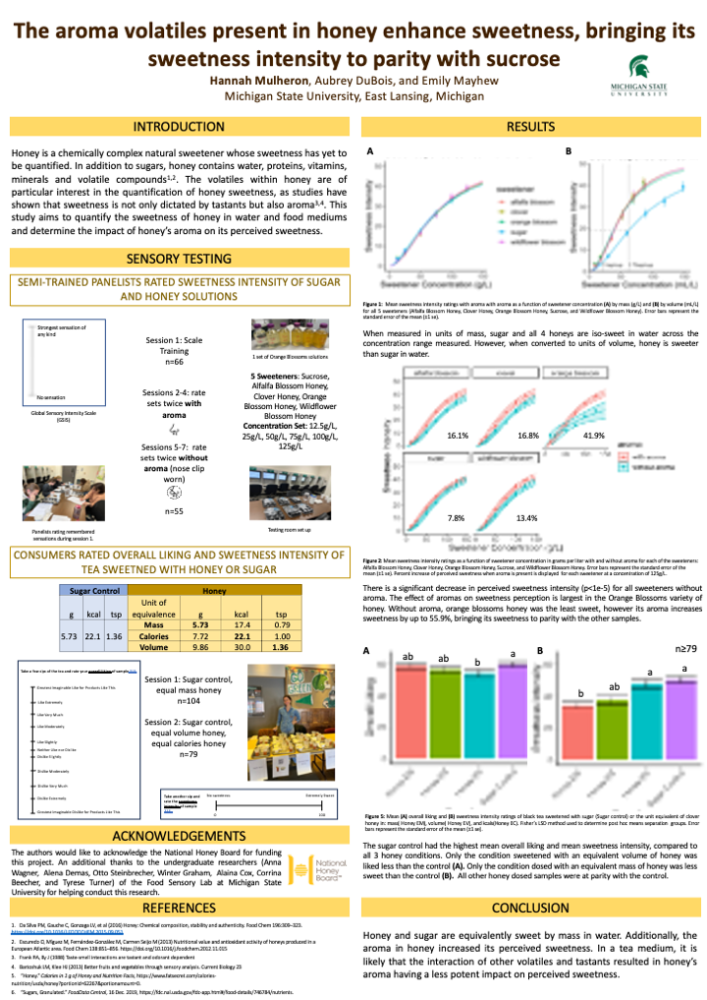

  

Insert descriptionnhere... maybe include a good infographic summary here?

## Articles

Mulheron, H., DuBois, A., and Mayhew, E. (2024). Quantifying the sweetness intensity and impact of aroma in honey from four floral sources. *Journal of Food Science*. In production. [https://www.doi.org/10.1111/1750-3841.17461]("https://www.doi.org/10.1111/1750-3841.17461")

## Presentations

Insert presentation decks here

## Posters

### 2024
:::{}

:::

### 2023 15th Pangborn Sensory Science Symposium
:::{}

:::